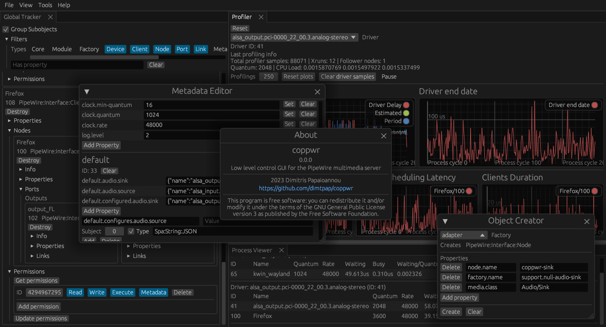

# coppwr
Low level control GUI for [PipeWire](https://pipewire.org)

## Description
**coppwr** is a tool that that provides low level control over the [PipeWire](https://pipewire.org) multimedia server.  
It aims to expose and provide as many ways to inspect and control the many aspects of the PipeWire multimedia server as possible.
It can be used as a diagnostic tool for PipeWire and to help develop software that interacts with it.
End-users of PipeWire that want to configure it should look into simpler tools
[recommended by the PipeWire devs](https://gitlab.freedesktop.org/pipewire/pipewire/-/wikis/FAQ#is-there-a-native-gui-tool-to-configure-pipewire).
If you want to learn the inner workings of PipeWire check out the [docs page on its design](https://docs.pipewire.org/page_pipewire.html)
and its [wiki](https://gitlab.freedesktop.org/pipewire/pipewire/-/wikis/home).

## Features
- Object inspection, creation & destruction
- Process monitoring & profiler statistics
- Metadata editing
- Module loading  
[More to be added...](https://github.com/dimtpap/coppwr/issues/1)

### Credits
- [egui](https://crates.io/crates/egui)+[eframe](https://crates.io/crates/eframe)
- [egui_dock](https://crates.io/crates/egui_dock)
- [A fork](https://gitlab.freedesktop.org/dimtpap/pipewire-rs/-/tree/coppwr) of [pipewire-rs](https://crates.io/crates/pipewire)