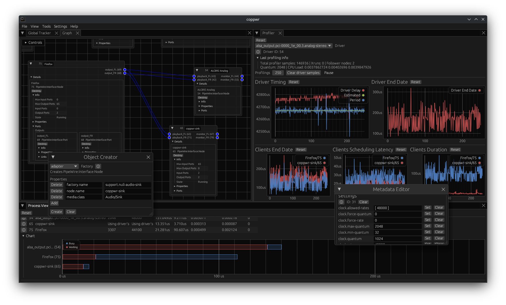

<div align="center">


# coppwr
Low level control GUI for [PipeWire](https://pipewire.org)


</div>

## Description
**coppwr** displays and provides control over many aspects of [PipeWire](https://pipewire.org) as directly as possible
in an organized and visual way. It can help with debugging and diagnosing a PipeWire setup or with developing software that interacts with PipeWire.  
End-users of PipeWire that want to configure it should look into simpler tools
[recommended by the PipeWire devs](https://gitlab.freedesktop.org/pipewire/pipewire/-/wikis/FAQ#is-there-a-native-gui-tool-to-configure-pipewire).
If you want to learn the inner workings of PipeWire check out the [docs page on its internals](https://docs.pipewire.org/page_internals.html) and its [wiki](https://gitlab.freedesktop.org/pipewire/pipewire/-/wikis/home).

## Features
- Node graph editing
- Object inspection, creation & destruction
- Process monitoring & profiler statistics
- Metadata editing
- Module loading
- Connecting to [XDG Desktop Portal](https://flatpak.github.io/xdg-desktop-portal/) remotes  
[More to be added...](https://github.com/dimtpap/coppwr/issues/1)

## Installing
### Flatpak
`io.github.dimtpap.coppwr` is available on [Flathub](https://flathub.org/apps/io.github.dimtpap.coppwr).

<a href='https://flathub.org/apps/io.github.dimtpap.coppwr'></a>
### Arch Linux
[](https://aur.archlinux.org/packages/coppwr)
[](https://aur.archlinux.org/packages/coppwr-bin)  
`coppwr-bin` is available from the [AUR](https://aur.archlinux.org/packages/coppwr-bin) (use `coppwr` for the non-prebuilt package).  
Use your AUR helper of choice or install it manually
```sh
git clone https://aur.archlinux.org/coppwr-bin.git
cd coppwr-bin
makepkg -i
```
### Debian, RPM
> [!NOTE]  
> coppwr does **not** self-update.

Debian and RPM packages are available from the [releases](https://github.com/dimtpap/coppwr/releases/latest).
## Building
### Requirements
- Rust and Cargo version `1.85` or later - https://www.rust-lang.org/tools/install
- bindgen [requirements](https://rust-lang.github.io/rust-bindgen/requirements.html)
- PipeWire library headers/PipeWire development packages

### Available [Cargo features](https://doc.rust-lang.org/cargo/reference/features.html)
- `pw_v0_3_77` - Used for the Link permission on PipeWire globals. Enable this if you're building with libpipewire 0.3.77 or later.
- `xdg_desktop_portals` - (**On** by default) Used for dark/light theme detection and opening PipeWire remotes with the [Camera](https://flatpak.github.io/xdg-desktop-portal/docs/doc-org.freedesktop.portal.Camera.html)
and [Screencast](https://flatpak.github.io/xdg-desktop-portal/docs/doc-org.freedesktop.portal.ScreenCast.html) portals.
- `persistence` (**On** by default) - Store application data like window info, graph node positions etc. on disk
### Build
In the repository's root directory
```sh
cargo build --release
```
See the [Cargo reference](https://doc.rust-lang.org/cargo/reference/features.html#command-line-feature-options) for info on how to use any of the above features
### Arch Linux
`coppwr` is available from the [AUR](https://aur.archlinux.org/packages/coppwr)
```sh
git clone https://aur.archlinux.org/coppwr.git
cd coppwr
makepkg
```
### Debian, RPM
Debian and RPM packages can be created using [cargo-deb](https://github.com/kornelski/cargo-deb#readme)
and [cargo-generate-rpm](https://github.com/cat-in-136/cargo-generate-rpm#cargo-generate-rpm) respectively.
See their usage instructions.

## Credits
- [egui](https://crates.io/crates/egui)+[eframe](https://crates.io/crates/eframe) - Immediate mode GUI for Rust and its desktop/web framework
- [egui_dock](https://crates.io/crates/egui_dock) - Docking support for egui
- ([A fork](https://github.com/kamirr/egui_node_graph) of) [egui_node_graph](https://crates.io/crates/egui_node_graph) - A helper library to create interactive node graphs using egui
- ([A fork](https://gitlab.freedesktop.org/dimtpap/pipewire-rs/-/tree/coppwr-next) of) [pipewire-rs](https://crates.io/crates/pipewire) - Rust bindings to libpipewire
- [ashpd](https://crates.io/crates/ashpd) - XDG Desktop Portals wrapper
- [pollster](https://crates.io/crates/pollster) - Simple async executor
